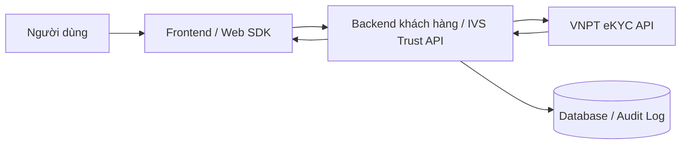
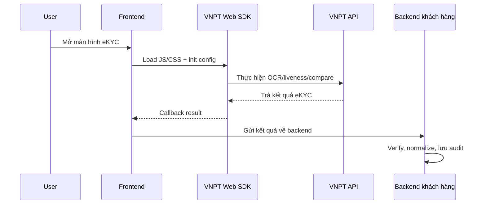
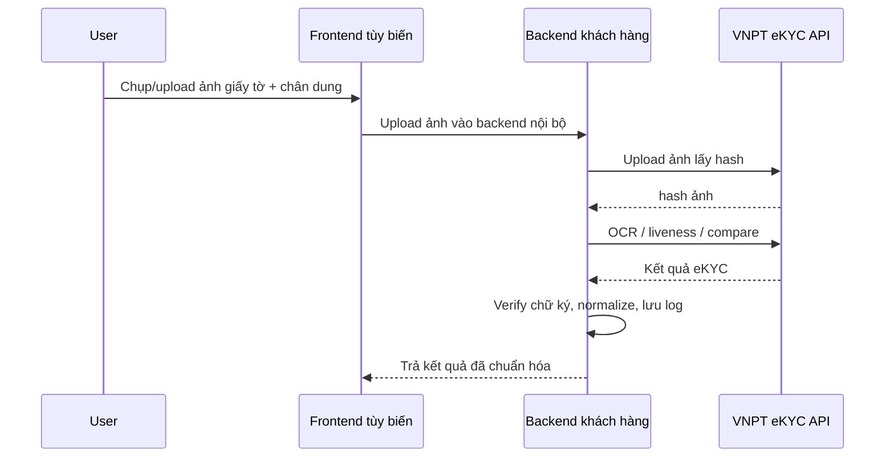
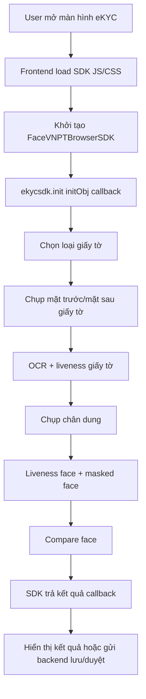
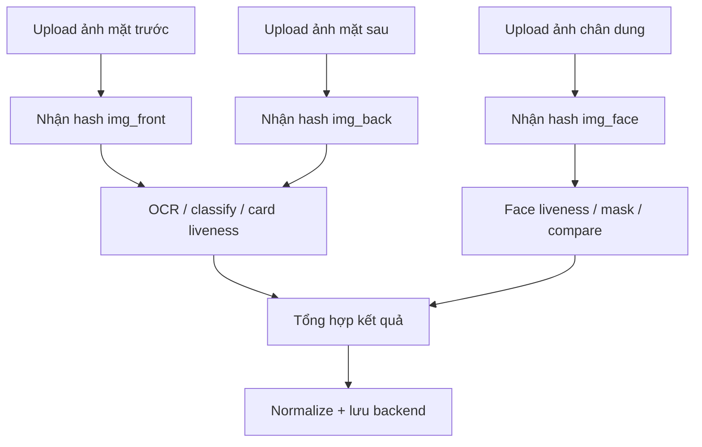
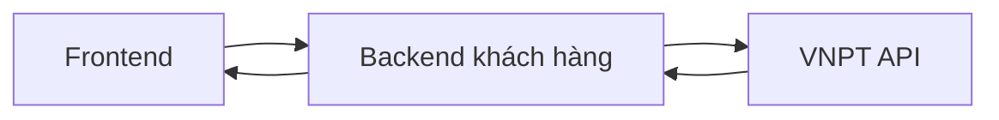
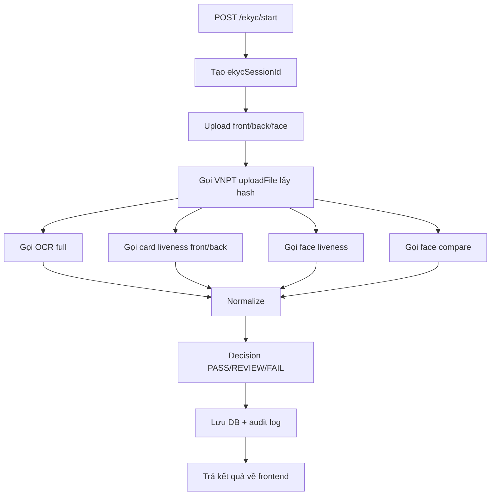
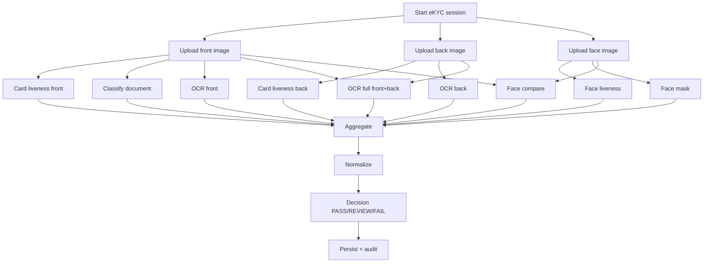

# Hướng dẫn tích hợp VNPT eKYC Web SDK & REST API

> **Phiên bản tài liệu:** 2.0  
> **Phạm vi:** Web SDK, REST API eKYC, backend proxy, bảo mật token, xác thực dữ liệu trả về.  
> **Đối tượng sử dụng:** Frontend Developer, Backend Developer, Technical Lead, DevOps, QA.  
> **Mục tiêu:** Tích hợp VNPT eKYC đúng kiến trúc, tránh lộ token, chuẩn hóa luồng xác thực định danh và sẵn sàng triển khai production.

---

## Mục lục

- [1. Tổng quan](#1-tổng-quan)
- [2. Kiến trúc tích hợp đề xuất](#2-kiến-trúc-tích-hợp-đề-xuất)
- [3. Chuẩn bị trước khi tích hợp](#3-chuẩn-bị-trước-khi-tích-hợp)
- [4. Phần A — Tích hợp VNPT eKYC Web SDK](#4-phần-a--tích-hợp-vnpt-ekyc-web-sdk)
- [5. Phần B — Tích hợp VNPT eKYC REST API](#5-phần-b--tích-hợp-vnpt-ekyc-rest-api)
- [6. Phần C — Chuẩn hóa dữ liệu trả về](#6-phần-c--chuẩn-hóa-dữ-liệu-trả-về)
- [7. Phần D — Bảo mật token và xác thực chữ ký](#7-phần-d--bảo-mật-token-và-xác-thực-chữ-ký)
- [8. Phần E — Backend proxy mẫu](#8-phần-e--backend-proxy-mẫu)
- [9. Phần F — Checklist triển khai production](#9-phần-f--checklist-triển-khai-production)
- [10. Phụ lục](#10-phụ-lục)

---

# 1. Tổng quan

VNPT eKYC hỗ trợ định danh điện tử cho website/web app thông qua hai cách tích hợp chính:

| Hình thức | Mục đích | Khi nào nên dùng |
|---|---|---|
| **Web SDK** | Nhúng sẵn luồng chụp giấy tờ, OCR, liveness, compare face vào frontend | Muốn triển khai nhanh, dùng UI/flow có sẵn của VNPT |
| **REST API** | Backend hoặc frontend tự điều phối từng bước: upload ảnh, OCR, liveness, face compare, face search | Muốn kiểm soát UI/UX, lưu hồ sơ nội bộ, tích hợp sâu với hệ thống KYC riêng |

## 1.1 Thành phần chức năng chính

- Upload ảnh lên hệ thống VNPT để lấy `hash`.
- Kiểm tra loại giấy tờ.
- Kiểm tra giấy tờ thật/giả.
- OCR mặt trước giấy tờ.
- OCR mặt sau giấy tờ.
- OCR đầy đủ mặt trước + mặt sau.
- Kiểm tra liveness khuôn mặt.
- Kiểm tra khuôn mặt bị che.
- So khớp khuôn mặt chân dung với ảnh trên giấy tờ.
- Thêm khuôn mặt vào hệ thống.
- Xác thực khuôn mặt với dữ liệu có sẵn.
- Tìm kiếm khuôn mặt giống nhất hoặc tập khuôn mặt gần giống nhất.
- Xác thực dữ liệu trả về bằng chữ ký số nếu VNPT cung cấp `dataBase64` và `dataSign`.

## 1.2 Nguyên tắc triển khai đúng

Không nên để frontend gọi trực tiếp VNPT API bằng token dài hạn trong production. Kiến trúc khuyến nghị:



Backend giữ token thật, frontend chỉ nhận session/token ngắn hạn hoặc gọi API nội bộ.

---

# 2. Kiến trúc tích hợp đề xuất

## 2.1 Mô hình nhanh — dùng Web SDK



**Ưu điểm:** nhanh, ít code frontend.  
**Rủi ro:** nếu nhúng token thật vào frontend thì dễ lộ token. Cần proxy hoặc token ngắn hạn.

## 2.2 Mô hình kiểm soát cao — dùng REST API qua backend



**Ưu điểm:** bảo mật hơn, kiểm soát dữ liệu và flow tốt hơn.  
**Nhược điểm:** cần backend xử lý file, retry, timeout, logging, audit.

## 2.3 Khuyến nghị cho hệ thống production

| Hạng mục | Khuyến nghị |
|---|---|
| Token VNPT | Chỉ lưu trong backend secret/env, không commit vào repo |
| Frontend | Không hard-code `TOKEN_ID`, `TOKEN_KEY`, `AUTHORIZION` thật |
| API call | Đi qua backend proxy nội bộ |
| Dữ liệu nhạy cảm | Mã hóa/lưu tối thiểu; không log ảnh base64 hoặc số giấy tờ đầy đủ |
| Audit | Lưu requestId, userId, ekycSessionId, trạng thái, mã lỗi, thời điểm |
| Webcam | Production bắt buộc HTTPS |
| Verify response | Dùng public key VNPT để kiểm tra `dataSign` nếu có |

---

# 3. Chuẩn bị trước khi tích hợp

## 3.1 Tài khoản VNPT eKYC

Cần đăng ký tài khoản eKYC và lấy thông tin token từ trang quản lý token của VNPT.

Các giá trị thường cần:

| Giá trị | Ý nghĩa |
|---|---|
| `TOKEN_ID` | Định danh token/client |
| `TOKEN_KEY` | Khóa token |
| `ACCESS_TOKEN` / `AUTHORIZION` | Bearer token gọi API |
| `PUBLIC_KEY` | Public key dùng verify chữ ký response nếu được cấp |
| `UNIT` | Mã đơn vị dùng cho các API face-service |

## 3.2 Domain API

```txt
https://api.idg.vnpt.vn
```

Trong tài liệu này gọi là:

```txt
<domain-name> = https://api.idg.vnpt.vn
```

## 3.3 Header API phổ biến

```http
Authorization: Bearer <VNPT_ACCESS_TOKEN>
Token-id: <VNPT_TOKEN_ID>
Token-key: <VNPT_TOKEN_KEY>
Content-Type: application/json
mac-address: TEST1
```

Với API upload file dạng `multipart/form-data`, không set cứng `Content-Type: application/json`.

## 3.4 Định dạng `client_session`

Một số API yêu cầu `client_session` theo định dạng:

```txt
<IOS/ANDROID>_<model name>_<OS/API>_<Device/Simulator>_<SDK version>_<Device id>_<Time stamp>
```

Ví dụ:

```txt
IOS_iphone6plus_ios13_Device_1.3.6_CC332797-E3E5-475F-8546-C9C4AA348837_1581429032
ANDROID_nokia7.2_28_Simulator_2.4.2_08d2d8686ee5fa0e_1581910116532
```

Với web app, backend có thể sinh session theo quy ước nội bộ, ví dụ:

```txt
WEB_chrome_windows_Device_2.1.0_<sessionId>_<timestamp>
```

## 3.5 Placeholder bắt buộc dùng trong tài liệu/code mẫu

Không đưa token thật vào tài liệu:

```env
VNPT_EKYC_BASE_URL=https://api.idg.vnpt.vn
VNPT_EKYC_TOKEN_ID=<VNPT_TOKEN_ID>
VNPT_EKYC_TOKEN_KEY=<VNPT_TOKEN_KEY>
VNPT_EKYC_ACCESS_TOKEN=<VNPT_ACCESS_TOKEN>
VNPT_EKYC_USERNAME=<VNPT_USERNAME_OPTIONAL>
VNPT_EKYC_PASSWORD=<VNPT_PASSWORD_OPTIONAL>
VNPT_EKYC_PUBLIC_KEY=<VNPT_PUBLIC_KEY>
VNPT_EKYC_UNIT=<VNPT_UNIT>
```

---

# 4. Phần A — Tích hợp VNPT eKYC Web SDK

## 4.1 Luồng cơ bản của SDK



## 4.2 Thư viện cần nhúng

Thêm vào `index.html` hoặc layout chính:

```html
<script src="https://cdnjs.cloudflare.com/ajax/libs/bodymovin/5.7.4/lottie.min.js"></script>
<script id="oval_custom" src="https://ekyc-web.icenter.ai/lib/VNPTBrowserSDKApp.js"></script>
<script src="https://ekyc-web.icenter.ai/lib/jsQR.js"></script>
```

File SDK chính và CSS:

```html
<script src="/ekyc-web-sdk-2.1.0.js"></script>
<link rel="stylesheet" href="/ekyc-web-sdk-2.1.0.css" />
```

## 4.3 Element mount SDK

```html
<div id="ekyc_sdk_intergrated"></div>
```

> Tên `ekyc_sdk_intergrated` giữ theo ví dụ gốc. Có thể đổi ID, nhưng phải đồng bộ với `PARRENT_ID` trong cấu hình SDK.

## 4.4 Bảng cấu hình SDK

| STT | Trường | Kiểu dữ liệu | Ý nghĩa |
|---:|---|---|---|
| 1 | `BACKEND_URL` | `string` | URL API backend. Có thể là VNPT hoặc backend proxy của khách hàng. |
| 2 | `TOKEN_KEY` | `string` | Token key đăng ký tại hệ thống VNPT eKYC. |
| 3 | `TOKEN_ID` | `string` | Token ID đăng ký tại hệ thống VNPT eKYC. |
| 4 | `AUTHORIZION` | `string` | Access token dùng authorize API. Có thể để trống nếu dùng captcha/token ngắn hạn. |
| 5 | `ENABLE_GGCAPCHAR` | `boolean` | Bật/tắt Google Captcha nếu SDK hỗ trợ. Tên trường giữ nguyên theo SDK. |
| 6 | `PARRENT_ID` | `string` | ID element cha để SDK mount. Tên trường giữ nguyên theo SDK. |
| 7 | `FLOW_TYPE` | `string` | `DOCUMENT` hoặc `FACE`. |
| 8 | `SHOW_RESULT` | `boolean` | Hiển thị màn kết quả mặc định của SDK. |
| 9 | `SHOW_HELP` | `boolean` | Hiển thị hướng dẫn thao tác. |
| 10 | `SHOW_TRADEMARK` | `boolean` | Hiển thị/ẩn trademark nếu SDK hỗ trợ. |
| 11 | `CHECK_LIVENESS_CARD` | `boolean` | Kiểm tra giấy tờ thật/giả. |
| 12 | `CHECK_LIVENESS_FACE` | `boolean` | Kiểm tra mặt thật. |
| 13 | `CHECK_MASKED_FACE` | `boolean` | Kiểm tra mặt bị che. |
| 14 | `COMPARE_FACE` | `boolean` | So sánh mặt giấy tờ với mặt chân dung. |
| 15 | `LANGUAGE` | `string` | `vi` hoặc `en`. |
| 16 | `LIST_ITEM` | `array` | Danh sách loại giấy tờ hiển thị. |
| 17 | `TYPE_DOCUMENT` | `number` | Loại giấy tờ mặc định hoặc `99` để hiển thị danh sách chọn. |
| 18 | `USE_WEBCAM` | `boolean` | Dùng webcam/camera. |
| 19 | `USE_UPLOAD` | `boolean` | Upload ảnh từ máy. |
| 20 | `ADVANCE_LIVENESS_FACE` | `boolean` | Liveness oval/advanced face liveness. |
| 21 | `LIST_CHOOSE_STYLE` | `object` | Tùy biến màn chọn giấy tờ. |
| 22 | `CAPTURE_IMAGE_STYLE` | `object` | Tùy biến màn chụp ảnh. |
| 23 | `RESULT_DEFAULT_STYLE` | `object` | Tùy biến màn kết quả. |
| 24 | `MOBILE_STYLE` | `object` | Tùy biến giao diện mobile. |

> Không tự ý sửa các tên trường bị sai chính tả theo SDK gốc như `AUTHORIZION`, `PARRENT_ID`, `ENABLE_GGCAPCHAR` nếu SDK không hỗ trợ alias.

## 4.5 Mã loại giấy tờ trong SDK

| Giá trị | Loại giấy tờ |
|---:|---|
| `-1` | Chứng minh thư / CMT / CMND / CCCD tùy luồng |
| `5` | Hộ chiếu |
| `6` | Bằng lái xe |
| `7` | Chứng minh thư quân đội |
| `9` | CCCD gắn chip |
| `99` | Hiển thị danh sách chọn loại giấy tờ |

Ví dụ:

```js
LIST_ITEM: [-1, 5, 6, 7, 9],
TYPE_DOCUMENT: 99
```

## 4.6 Cấu hình SDK mẫu an toàn

```js
const initObj = {
  BACKEND_URL: "",

  TOKEN_KEY: "<VNPT_TOKEN_KEY>",
  TOKEN_ID: "<VNPT_TOKEN_ID>",
  AUTHORIZION: "<VNPT_ACCESS_TOKEN_OR_SHORT_LIVED_TOKEN>",

  ENABLE_GGCAPCHAR: true,
  PARRENT_ID: "ekyc_sdk_intergrated",

  FLOW_TYPE: "DOCUMENT", // DOCUMENT hoặc FACE

  SHOW_RESULT: true,
  SHOW_HELP: true,
  SHOW_TRADEMARK: false,

  CHECK_LIVENESS_CARD: true,
  CHECK_LIVENESS_FACE: true,
  CHECK_MASKED_FACE: true,
  COMPARE_FACE: true,

  LANGUAGE: "vi",
  LIST_ITEM: [-1, 5, 6, 7, 9],
  TYPE_DOCUMENT: 99,

  USE_WEBCAM: true,
  USE_UPLOAD: false,
  ADVANCE_LIVENESS_FACE: true,

  LIST_CHOOSE_STYLE: {
    background: "#ffffff",
    text_color: "#111827",
    border_item: "",
    item_active_color: "#18D696",
    background_icon: "#18D696",
    id_icon: "https://ekyc-web.icenter.ai/images/si/id_card.svg",
    passport_icon: "https://ekyc-web.icenter.ai/images/si/passport.svg",
    drivecard_icon: "https://ekyc-web.icenter.ai/images/si/drivecard.svg",
    army_id_icon: "https://ekyc-web.icenter.ai/images/si/other_doc.svg",
    id_chip_icon: "https://ekyc-web.icenter.ai/images/si/id_chip.svg",
    start_button_background: "#18D696",
    start_button_color: "#111127"
  },

  CAPTURE_IMAGE_STYLE: {
    popup1_box_shadow: "0px 0px 2px rgba(0,0,0,0.06), 0px 3px 8px rgba(0,0,0,0.1)",
    popup1_title_color: "#C8242D",
    description1_color: "#ffffff",
    capture_btn_background: "#18D696",
    capture_btn_color: "#111127",
    capture_btn_icon: "https://ekyc-web.icenter.ai/images/hdbank/capture.svg",
    tutorial_btn_icon: "https://ekyc-web.icenter.ai/images/hdbank/help.gif",
    recapture_btn_background: "linear-gradient(180deg, #FDFDFD 0%, #DEDEDE 100%)",
    recapture_btn_color: "#111127",
    recapture_btn_border: "2px solid #FEDC00",
    recapture_btn_icon: "https://ekyc-web.icenter.ai/images/hdbank/capture.svg",
    nextstep_btn_background: "#18D696",
    nextstep_btn_color: "#111127",
    nextstep_btn_icon: "https://ekyc-web.icenter.ai/images/hdbank/next_icon.svg",
    popup2_box_shadow: "0px 0px 2px rgba(0,0,0,0.06), 0px 3px 8px rgba(0,0,0,0.1)",
    popup2_title_header_color: "#C8242D",
    popup2_icon_header: "https://ekyc-web.icenter.ai/images/hdbank/main_icon.svg",
    popup2_icon_warning1: "",
    popup2_icon_warning2: "",
    popup2_icon_warning3: ""
  },

  RESULT_DEFAULT_STYLE: {
    redemo_btn_background: "#18D696",
    redemo_btn_icon: "https://ekyc-web.icenter.ai/images/hdbank/refresh.svg",
    redemo_btn_color: "#111127"
  },

  MOBILE_STYLE: {
    mobile_capture_btn: "https://ekyc-web.icenter.ai/images/capure_mobile.png",
    mobile_capture_desc_color: "#18D696",
    mobile_tutorial_color: "#C8242D",
    mobile_recapture_btn_background: "linear-gradient(180deg, #FDFDFD 0%, #DEDEDE 100%)",
    mobile_recapture_btn_border: "1px solid #18D696",
    mobile_recapture_btn_icon: "https://ekyc-web.icenter.ai/images/hdbank/capture.svg",
    mobile_recapture_btn_color: "#111127",
    mobile_nextstep_btn_background: "#18D696",
    mobile_nextstep_btn_color: "#111127",
    mobile_nextstep_btn_icon: "https://ekyc-web.icenter.ai/images/next_icon_b.png",
    mobile_popup2_icon_header: "https://ekyc-web.icenter.ai/images/hdbank/face_icon_popup.svg"
  }
};
```

## 4.7 Tích hợp HTML thuần

```html
<!doctype html>
<html lang="vi">
<head>
  <meta charset="UTF-8" />
  <meta name="viewport" content="width=device-width, initial-scale=1.0" />
  <title>VNPT eKYC Demo</title>

  <script src="https://cdnjs.cloudflare.com/ajax/libs/bodymovin/5.7.4/lottie.min.js"></script>
  <script id="oval_custom" src="https://ekyc-web.icenter.ai/lib/VNPTBrowserSDKApp.js"></script>
  <script src="https://ekyc-web.icenter.ai/lib/jsQR.js"></script>
</head>
<body>
  <div id="ekyc_sdk_intergrated"></div>

  <script>
    const sdkScript = document.createElement("script");
    sdkScript.id = "vnpt_ekyc_sdk";
    sdkScript.src = "/ekyc-web-sdk-2.1.0.js";
    sdkScript.async = true;
    document.head.appendChild(sdkScript);

    const sdkStyle = document.createElement("link");
    sdkStyle.id = "vnpt_ekyc_styles";
    sdkStyle.rel = "stylesheet";
    sdkStyle.href = "/ekyc-web-sdk-2.1.0.css";
    document.head.appendChild(sdkStyle);

    sdkScript.onload = async function () {
      await FaceVNPTBrowserSDK.init();

      const initObj = {
        BACKEND_URL: "",
        TOKEN_KEY: "<VNPT_TOKEN_KEY>",
        TOKEN_ID: "<VNPT_TOKEN_ID>",
        AUTHORIZION: "<VNPT_ACCESS_TOKEN_OR_SHORT_LIVED_TOKEN>",
        ENABLE_GGCAPCHAR: true,
        PARRENT_ID: "ekyc_sdk_intergrated",
        FLOW_TYPE: "DOCUMENT",
        SHOW_RESULT: true,
        SHOW_HELP: true,
        SHOW_TRADEMARK: false,
        CHECK_LIVENESS_CARD: true,
        CHECK_LIVENESS_FACE: true,
        CHECK_MASKED_FACE: true,
        COMPARE_FACE: true,
        LANGUAGE: "vi",
        LIST_ITEM: [-1, 5, 6, 7, 9],
        TYPE_DOCUMENT: 99,
        USE_WEBCAM: true,
        USE_UPLOAD: false,
        ADVANCE_LIVENESS_FACE: true
      };

      ekycsdk.init(initObj, function (res) {
        console.log("VNPT eKYC result", res);
        ekycsdk.viewResult(res.type_document, res);

        // Khuyến nghị: gửi về backend để verify + lưu trạng thái
        // fetch('/api/ekyc/vnpt/result', { method: 'POST', body: JSON.stringify(res) })
      });
    };
  </script>
</body>
</html>
```

## 4.8 Tích hợp ReactJS

### `index.html`

```html
<script src="https://cdnjs.cloudflare.com/ajax/libs/bodymovin/5.7.4/lottie.min.js"></script>
<script id="oval_custom" src="https://ekyc-web.icenter.ai/lib/VNPTBrowserSDKApp.js"></script>
<script src="https://ekyc-web.icenter.ai/lib/jsQR.js"></script>
```

### Component `VnptEkyc.tsx`

```tsx
import { useEffect, useRef } from "react";

declare global {
  interface Window {
    FaceVNPTBrowserSDK: any;
    ekycsdk: any;
  }
}

function loadScript(id: string, src: string) {
  return new Promise<void>((resolve, reject) => {
    if (document.getElementById(id)) return resolve();

    const script = document.createElement("script");
    script.id = id;
    script.src = src;
    script.async = true;
    script.onload = () => resolve();
    script.onerror = () => reject(new Error(`Cannot load script: ${src}`));
    document.head.appendChild(script);
  });
}

function loadStyle(id: string, href: string) {
  if (document.getElementById(id)) return;

  const link = document.createElement("link");
  link.id = id;
  link.rel = "stylesheet";
  link.href = href;
  document.head.appendChild(link);
}

export function VnptEkyc() {
  const mountedRef = useRef(false);

  useEffect(() => {
    if (mountedRef.current) return;
    mountedRef.current = true;

    async function boot() {
      loadStyle("vnpt_ekyc_styles", "/ekyc-web-sdk-2.1.0.css");
      await loadScript("vnpt_ekyc_sdk", "/ekyc-web-sdk-2.1.0.js");
      await window.FaceVNPTBrowserSDK.init();

      const initObj = {
        BACKEND_URL: "",
        TOKEN_KEY: "<VNPT_TOKEN_KEY>",
        TOKEN_ID: "<VNPT_TOKEN_ID>",
        AUTHORIZION: "<VNPT_ACCESS_TOKEN_OR_SHORT_LIVED_TOKEN>",
        ENABLE_GGCAPCHAR: true,
        PARRENT_ID: "ekyc_sdk_intergrated",
        FLOW_TYPE: "DOCUMENT",
        SHOW_RESULT: true,
        SHOW_HELP: true,
        SHOW_TRADEMARK: false,
        CHECK_LIVENESS_CARD: true,
        CHECK_LIVENESS_FACE: true,
        CHECK_MASKED_FACE: true,
        COMPARE_FACE: true,
        LANGUAGE: "vi",
        LIST_ITEM: [-1, 5, 6, 7, 9],
        TYPE_DOCUMENT: 99,
        USE_WEBCAM: true,
        USE_UPLOAD: false,
        ADVANCE_LIVENESS_FACE: true
      };

      window.ekycsdk.init(initObj, async (res: unknown) => {
        console.log("VNPT eKYC result", res);
        window.ekycsdk.viewResult((res as any).type_document, res);
      });
    }

    boot().catch(console.error);
  }, []);

  return <div id="ekyc_sdk_intergrated" />;
}
```

## 4.9 Tích hợp Angular

### Template

```html
<div id="ekyc_sdk_intergrated"></div>
```

### Component

```ts
declare const FaceVNPTBrowserSDK: any;
declare const ekycsdk: any;

export class VnptEkycComponent {
  ngOnInit(): void {
    this.loadEkycSDK();
  }

  private loadEkycSDK(): void {
    const sdkScript = document.createElement("script");
    sdkScript.id = "vnpt_ekyc_sdk";
    sdkScript.src = "/ekyc-web-sdk-2.1.0.js";
    sdkScript.async = true;
    document.head.appendChild(sdkScript);

    const sdkStyle = document.createElement("link");
    sdkStyle.id = "vnpt_ekyc_styles";
    sdkStyle.rel = "stylesheet";
    sdkStyle.href = "/ekyc-web-sdk-2.1.0.css";
    document.head.appendChild(sdkStyle);

    sdkScript.onload = async () => {
      await FaceVNPTBrowserSDK.init();

      const initObj = {
        BACKEND_URL: "",
        TOKEN_KEY: "<VNPT_TOKEN_KEY>",
        TOKEN_ID: "<VNPT_TOKEN_ID>",
        AUTHORIZION: "<VNPT_ACCESS_TOKEN_OR_SHORT_LIVED_TOKEN>",
        ENABLE_GGCAPCHAR: true,
        PARRENT_ID: "ekyc_sdk_intergrated",
        FLOW_TYPE: "DOCUMENT",
        SHOW_RESULT: true,
        SHOW_HELP: true,
        SHOW_TRADEMARK: false,
        CHECK_LIVENESS_CARD: true,
        CHECK_LIVENESS_FACE: true,
        CHECK_MASKED_FACE: true,
        COMPARE_FACE: true,
        LANGUAGE: "vi",
        LIST_ITEM: [-1, 5, 6, 7, 9],
        TYPE_DOCUMENT: 99,
        USE_WEBCAM: true,
        USE_UPLOAD: false,
        ADVANCE_LIVENESS_FACE: true
      };

      ekycsdk.init(initObj, (res: any) => {
        console.log("VNPT eKYC result", res);
        ekycsdk.viewResult(res.type_document, res);
      });
    };
  }
}
```

## 4.10 Tích hợp VueJS

### `index.html`

```html
<script src="https://cdnjs.cloudflare.com/ajax/libs/bodymovin/5.7.4/lottie.min.js"></script>
<script id="oval_custom" src="https://ekyc-web.icenter.ai/lib/VNPTBrowserSDKApp.js"></script>
<script src="https://ekyc-web.icenter.ai/lib/jsQR.js"></script>
```

### Component Vue 3

```vue
<template>
  <div id="ekyc_sdk_intergrated"></div>
</template>

<script setup lang="ts">
import { onMounted } from "vue";

declare const FaceVNPTBrowserSDK: any;
declare const ekycsdk: any;

function loadScript(id: string, src: string) {
  return new Promise<void>((resolve, reject) => {
    if (document.getElementById(id)) return resolve();
    const script = document.createElement("script");
    script.id = id;
    script.src = src;
    script.async = true;
    script.onload = () => resolve();
    script.onerror = () => reject(new Error(`Cannot load ${src}`));
    document.head.appendChild(script);
  });
}

function loadStyle(id: string, href: string) {
  if (document.getElementById(id)) return;
  const link = document.createElement("link");
  link.id = id;
  link.rel = "stylesheet";
  link.href = href;
  document.head.appendChild(link);
}

onMounted(async () => {
  loadStyle("vnpt_ekyc_styles", "/ekyc-web-sdk-2.1.0.css");
  await loadScript("vnpt_ekyc_sdk", "/ekyc-web-sdk-2.1.0.js");
  await FaceVNPTBrowserSDK.init();

  const initObj = {
    BACKEND_URL: "",
    TOKEN_KEY: "<VNPT_TOKEN_KEY>",
    TOKEN_ID: "<VNPT_TOKEN_ID>",
    AUTHORIZION: "<VNPT_ACCESS_TOKEN_OR_SHORT_LIVED_TOKEN>",
    ENABLE_GGCAPCHAR: true,
    PARRENT_ID: "ekyc_sdk_intergrated",
    FLOW_TYPE: "DOCUMENT",
    SHOW_RESULT: true,
    SHOW_HELP: true,
    SHOW_TRADEMARK: false,
    CHECK_LIVENESS_CARD: true,
    CHECK_LIVENESS_FACE: true,
    CHECK_MASKED_FACE: true,
    COMPARE_FACE: true,
    LANGUAGE: "vi",
    LIST_ITEM: [-1, 5, 6, 7, 9],
    TYPE_DOCUMENT: 99,
    USE_WEBCAM: true,
    USE_UPLOAD: false,
    ADVANCE_LIVENESS_FACE: true
  };

  ekycsdk.init(initObj, (res: any) => {
    console.log("VNPT eKYC result", res);
    ekycsdk.viewResult(res.type_document, res);
  });
});
</script>
```

## 4.11 Lấy kết quả SDK

SDK trả kết quả trong callback:

```js
ekycsdk.init(initObj, (res) => {
  console.log("res", res);
  ekycsdk.viewResult(res.type_document, res);
});
```

Có thể không dùng màn view mặc định của SDK và tự dựng UI theo dữ liệu trả về:

```js
ekycsdk.init(initObj, (res) => {
  const data = res;

  const normalized = {
    documentType: data.type_document,
    fullName: data.ocr?.name,
    identityNumber: data.ocr?.id,
    birthDate: data.ocr?.birth_day,
    gender: data.ocr?.gender,
    nationality: data.ocr?.nationality,
    issueDate: data.ocr?.issue_date,
    issuePlace: data.ocr?.issue_place,
    faceMatch: data.compare?.msg,
    faceMatchProbability: data.compare?.prob,
    cardLivenessFront: data.liveness_card_front?.liveness,
    cardLivenessBack: data.liveness_card_back?.liveness,
    faceLiveness: data.liveness_face?.liveness,
    masked: data.masked?.object?.masked
  };

  console.log("normalized", normalized);
});
```

## 4.12 Nối luồng DOCUMENT sang FACE

```js
ekycsdk.init(
  initObj,
  (res) => {
    console.log("document result", res);
    ekycsdk.viewResult(res.type_document, res);
  },
  callAfterDocumentFlow
);

function callAfterDocumentFlow(documentData) {
  const vnptEkyc = document.getElementById("vnpt_ekyc");
  if (vnptEkyc?.parentNode) {
    vnptEkyc.parentNode.removeChild(vnptEkyc);
  }

  ekycsdk.init(
    {
      ...initObj,
      FLOW_TYPE: "FACE",
      TYPE_DOCUMENT: documentData.type_document
    },
    (faceData) => {
      const merged = { ...documentData, ...faceData };
      ekycsdk.viewResult(documentData.type_document, merged);
    }
  );
}
```

## 4.13 Lỗi thường gặp khi dùng SDK

### 4.13.1 Không mở được webcam trên HTTP

Browser hiện đại không cho phép truy cập camera trên domain không có SSL. Production phải dùng HTTPS.

### 4.13.2 SDK không render

Kiểm tra:

- File SDK JS/CSS đã load thành công.
- `FaceVNPTBrowserSDK` tồn tại trên `window`.
- `ekycsdk` tồn tại trên `window`.
- `PARRENT_ID` khớp với ID DOM.
- SDK không bị chặn bởi CSP, adblock, firewall.

### 4.13.3 Callback không trả kết quả

Kiểm tra:

- Token hợp lệ.
- Network request đến VNPT thành công.
- `FLOW_TYPE` đúng.
- Quyền camera đã được cấp.
- Ảnh đầu vào đủ sáng, rõ, đúng giấy tờ.

---

# 5. Phần B — Tích hợp VNPT eKYC REST API

## 5.1 Tổng quan REST API

Kết quả của API **upload ảnh** là đầu vào cho các API OCR, liveness, compare face và face-service. Vì vậy luồng REST API thường bắt đầu bằng việc upload từng ảnh để lấy `hash`.



VNPT khuyến nghị sử dụng eKYC SDK để có kết quả tốt nhất vì SDK có nhiều bước tiền xử lý, hỗ trợ flow chụp ảnh và tích hợp các model AI trước khi gửi kiểm tra/bóc tách.

## 5.2 Danh sách API

| STT | API | Method | URL |
|---:|---|---|---|
| 1 | Upload ảnh | `POST` | `/file-service/v1/addFile` |
| 2 | Kiểm tra loại giấy tờ | `POST` | `/ai/v1/classify/id` |
| 3 | Kiểm tra giấy tờ thật/giả | `POST` | `/ai/v1/card/liveness` |
| 4 | OCR mặt trước giấy tờ | `POST` | `/ai/v1/ocr/id/front` |
| 5 | OCR mặt sau giấy tờ | `POST` | `/ai/v1/ocr/id/back` |
| 6 | OCR đầy đủ giấy tờ | `POST` | `/ai/v1/ocr/id` |
| 7 | So sánh khuôn mặt giấy tờ với chân dung | `POST` | `/ai/v1/face/compare` |
| 8 | Kiểm tra mặt thật | `POST` | `/ai/v1/face/liveness` |
| 9 | Kiểm tra che mặt | `POST` | `/ai/v1/face/mask` |
| 10 | Thêm hình ảnh khuôn mặt vào hệ thống | `POST` | `/face-service/face/add` |
| 11 | Xác thực khuôn mặt với ảnh có sẵn | `POST` | `/face-service/face/verify` |
| 12 | Tìm kiếm một khuôn mặt giống nhất | `POST` | `/face-service/face/search` |
| 13 | Tìm kiếm tập khuôn mặt gần giống nhất | `POST` | `/face-service/face/search-k` |

## 5.3 API 1 — Upload ảnh

### Chức năng

Upload file ảnh lên VNPT để lấy `hash`. Mã `hash` này dùng làm đầu vào cho các API khác.

### Endpoint

```http
POST <domain-name>/file-service/v1/addFile
```

### Header

```http
Authorization: Bearer <VNPT_ACCESS_TOKEN>
Token-id: <VNPT_TOKEN_ID>
Token-key: <VNPT_TOKEN_KEY>
```

### Body `form-data`

| Key | Type | Required | Mô tả |
|---|---|---:|---|
| `file` | `File` | Có | File ảnh upload |
| `title` | `string` | Nên có | Tiêu đề ảnh |
| `description` | `string` | Nên có | Mô tả ảnh |

### Response thành công

```json
{
  "message": "IDG-00000000",
  "object": {
    "fileName": "front_card",
    "title": "ocr front",
    "description": "ocr front",
    "hash": "idg-.../IDG01_...",
    "fileType": "jpg",
    "uploadedDate": "7/29/20 10:25 AM",
    "storageType": "IDG01",
    "tokenId": "<TOKEN_ID>"
  }
}
```

### Trường dữ liệu trả về

| Trường | Type | Ý nghĩa |
|---|---|---|
| `message` | `string` | Mã kết quả, thành công thường là `IDG-00000000` |
| `object.fileName` | `string` | Tên file |
| `object.title` | `string` | Tiêu đề file |
| `object.description` | `string` | Mô tả file |
| `object.hash` | `string` | Mã hash ảnh dùng cho các API sau |
| `object.fileType` | `string` | Định dạng file |
| `object.uploadedDate` | `string` | Thời gian upload |
| `object.storageType` | `string` | Kiểu lưu trữ |
| `object.tokenId` | `string` | Token ID trả về |

### cURL mẫu

```bash
curl -X POST "https://api.idg.vnpt.vn/file-service/v1/addFile" \
  -H "Authorization: Bearer <VNPT_ACCESS_TOKEN>" \
  -H "Token-id: <VNPT_TOKEN_ID>" \
  -H "Token-key: <VNPT_TOKEN_KEY>" \
  -F "file=@/path/to/front.jpg" \
  -F "title=ocr front" \
  -F "description=front card image"
```

## 5.4 API 2 — Kiểm tra loại giấy tờ

### Chức năng

Nhận ảnh giấy tờ và trả về loại giấy tờ: CMND cũ/mới, bằng lái xe, hộ chiếu, chứng minh quân đội hoặc giấy tờ khác.

### Endpoint

```http
POST <domain-name>/ai/v1/classify/id
```

### Header

```http
Content-Type: application/json
Authorization: Bearer <VNPT_ACCESS_TOKEN>
Token-id: <VNPT_TOKEN_ID>
Token-key: <VNPT_TOKEN_KEY>
mac-address: TEST1
```

### Body

```json
{
  "img_card": "<IMAGE_HASH>",
  "client_session": "<CLIENT_SESSION>",
  "token": "<REQUEST_TOKEN>"
}
```

| Key | Type | Required | Mô tả |
|---|---|---:|---|
| `img_card` | `string` | Có | Hash ảnh giấy tờ từ API upload |
| `client_session` | `string` | Có | Session theo định dạng VNPT |
| `token` | `string` | Có | Chuỗi ký tự bất kỳ, không dùng ký tự đặc biệt |

### Response thành công

```json
{
  "message": "IDG-00000000",
  "object": {
    "type": 0,
    "name": "old_front"
  }
}
```

### Mã loại trả về

| `type` | Ý nghĩa |
|---:|---|
| `0`, `1` | CMT cũ trước/sau |
| `2`, `3` | CMND mới trước/sau |
| `4` | Giấy tờ khác |
| `5` | Hộ chiếu |

### Response lỗi

```json
{
  "status": "Bad request",
  "message": "IDG-00010102",
  "statusCode": "400",
  "errors": ["Dữ liệu đầu vào không đúng quy định. Không phải là ảnh"]
}
```

## 5.5 API 3 — Kiểm tra giấy tờ thật/giả

### Chức năng

Kiểm tra ảnh giấy tờ có phải được chụp từ giấy tờ thật hay không.

### Endpoint

```http
POST <domain-name>/ai/v1/card/liveness
```

### Body

```json
{
  "img": "<IMAGE_HASH>",
  "client_session": "<CLIENT_SESSION>"
}
```

| Key | Type | Required | Mô tả |
|---|---|---:|---|
| `img` | `string` | Có | Hash ảnh giấy tờ |
| `client_session` | `string` | Có | Session theo định dạng VNPT |

### Response thành công

```json
{
  "message": "IDG-00000000",
  "object": {
    "liveness": "success",
    "liveness_msg": "Giấy tờ thật",
    "face_swapping": false,
    "fake_liveness": false
  }
}
```

| Trường | Type | Ý nghĩa |
|---|---|---|
| `face_swapping` | `boolean` | Kiểm tra giấy tờ có dán ảnh hay không |
| `fake_liveness` | `boolean` | Kiểm tra giấy tờ có bị chụp lại hay không |
| `liveness` | `string` | `success` hoặc `failure` |
| `liveness_msg` | `string` | Mô tả kết quả |

## 5.6 API 4 — OCR mặt trước giấy tờ

### Chức năng

Bóc tách thông tin mặt trước của giấy tờ.

### Endpoint

```http
POST <domain-name>/ai/v1/ocr/id/front
```

### Body

```json
{
  "img_front": "<FRONT_IMAGE_HASH>",
  "client_session": "<CLIENT_SESSION>",
  "type": -1,
  "validate_postcode": true,
  "token": "<REQUEST_TOKEN>"
}
```

| Key | Type | Required | Mô tả |
|---|---|---:|---|
| `img_front` | `string` | Có | Hash ảnh mặt trước |
| `client_session` | `string` | Có | Session theo định dạng VNPT |
| `type` | `integer` | Tùy loại | `-1`, `5`, `6`, `7` |
| `validate_postcode` | `boolean` | Không | Kiểm tra quy luật/mã địa chỉ |
| `token` | `string` | Có | Chuỗi định danh request |

### Response thành công rút gọn

```json
{
  "message": "IDG-00000000",
  "server_version": "1.2.5",
  "object": {
    "msg": "OK",
    "card_type": "GIẤY CHỨNG MINH NHÂN DÂN",
    "id": "012551828",
    "name": "NGUYỄN QUANG HUY",
    "birth_day": "26/12/1989",
    "gender": "-",
    "nationality": "-",
    "origin_location": "Duy Tiên, Hà Nam",
    "recent_location": "A3-8 Lý Nam Đế, Hoàn Kiếm, Hà Nội",
    "valid_date": "-",
    "type_id": 0,
    "tampering": {
      "is_legal": "yes",
      "warning": []
    }
  }
}
```

### Các trường OCR quan trọng

| Trường | Type | Ý nghĩa |
|---|---|---|
| `msg` | `string` | `OK` nếu OCR thành công |
| `card_type` | `string` | Loại giấy tờ |
| `id` | `string` | Số CMND/CCCD |
| `id_probs` | `string` | Xác suất từng ký tự số ID |
| `name` | `string` | Họ tên |
| `name_prob` | `float` | Xác suất trường họ tên |
| `birth_day` | `string` | Ngày sinh |
| `birth_day_prob` | `float` | Xác suất ngày sinh |
| `nationality` | `string` | Quốc tịch |
| `nation` | `string` | Dân tộc |
| `gender` | `string` | Giới tính |
| `valid_date` | `string` | Ngày hết hạn |
| `origin_location` | `string` | Nguyên quán / quê quán |
| `origin_location_prob` | `float` | Xác suất nguyên quán |
| `recent_location` | `string` | Nơi thường trú |
| `recent_location_prob` | `float` | Xác suất thường trú |
| `type_id` | `integer` | Loại chứng minh mặt trước |
| `warning` | `list` | Mã cảnh báo ảnh đầu vào |
| `warning_msg` | `list` | Nội dung cảnh báo tương ứng |
| `expire_warning` | `string` | Cảnh báo hết hạn mặt trước |
| `post_code` | `list` | Thông tin tỉnh/huyện/xã chuẩn hóa |
| `tampering` | `object` | Kiểm tra tính hợp lệ/tampering |
| `tampering.is_legal` | `string` | `yes` hoặc `no` |
| `tampering.warning` | `array` | Danh sách cảnh báo |

## 5.7 API 5 — OCR mặt sau giấy tờ

### Chức năng

Bóc tách thông tin mặt sau giấy tờ.

### Endpoint

```http
POST <domain-name>/ai/v1/ocr/id/back
```

### Body

```json
{
  "img_back": "<BACK_IMAGE_HASH>",
  "client_session": "<CLIENT_SESSION>",
  "type": -1,
  "token": "<REQUEST_TOKEN>"
}
```

| Key | Type | Required | Mô tả |
|---|---|---:|---|
| `img_back` | `string` | Có | Hash ảnh mặt sau |
| `client_session` | `string` | Có | Session theo định dạng VNPT |
| `type` | `integer` | Có | `-1`, `5`, `6`, `7` |
| `token` | `string` | Có | Chuỗi định danh request |

### Response thành công rút gọn

```json
{
  "message": "IDG-00000000",
  "server_version": "1.2.5",
  "object": {
    "issue_place": "Hà Nội",
    "issue_date": "23/02/2011",
    "issue_date_prob": 1,
    "issue_place_prob": 0.9999996991384597,
    "back_type_id": 0,
    "back_expire_warning": "no",
    "msg_back": "OK"
  }
}
```

### Trường quan trọng

| Trường | Type | Ý nghĩa |
|---|---|---|
| `msg_back` | `string` | `OK` nếu OCR mặt sau thành công |
| `issue_date` | `string` | Ngày cấp |
| `issue_date_prob` | `float` | Xác suất ngày cấp |
| `issue_place` | `string` | Nơi cấp |
| `issue_place_prob` | `float` | Xác suất nơi cấp |
| `back_type_id` | `integer` | Loại mặt sau giấy tờ |
| `back_expire_warning` | `string` | Cảnh báo hết hạn mặt sau |
| `warning` | `list` | Mã cảnh báo ảnh đầu vào |
| `warning_msg` | `list` | Nội dung cảnh báo |

## 5.8 API 6 — OCR đầy đủ giấy tờ

### Chức năng

Bóc tách thông tin mặt trước và mặt sau của giấy tờ trong một request.

### Endpoint

```http
POST <domain-name>/ai/v1/ocr/id
```

### Body

```json
{
  "img_front": "<FRONT_IMAGE_HASH>",
  "img_back": "<BACK_IMAGE_HASH>",
  "client_session": "<CLIENT_SESSION>",
  "type": -1,
  "crop_param": "0.14,0.3",
  "validate_postcode": true,
  "token": "<REQUEST_TOKEN>"
}
```

| Key | Type | Required | Mô tả |
|---|---|---:|---|
| `img_front` | `string` | Có | Hash ảnh mặt trước |
| `img_back` | `string` | Có | Hash ảnh mặt sau |
| `client_session` | `string` | Có | Session theo định dạng VNPT |
| `type` | `integer` | Tùy loại | `-1`, `5`, `6`, `7` |
| `crop_param` | `string` | Có theo tài liệu | Tỷ lệ crop ảnh, ví dụ `0.14,0.3` |
| `validate_postcode` | `boolean` | Không | Kiểm tra quy luật/mã địa chỉ |
| `token` | `string` | Có | Chuỗi định danh request |

### Response thành công rút gọn

```json
{
  "message": "IDG-00000000",
  "object": {
    "msg": "OK",
    "msg_back": "OK",
    "card_type": "GIẤY CHỨNG MINH NHÂN DÂN",
    "id": "012551828",
    "name": "NGUYỄN QUANG HUY",
    "birth_day": "26/12/1989",
    "issue_date": "23/02/2011",
    "issue_place": "Hà Nội",
    "origin_location": "Duy Tiên, Hà Nam",
    "recent_location": "A3-8 Lý Nam Đế, Hoàn Kiếm, Hà Nội",
    "tampering": {
      "is_legal": "yes",
      "warning": []
    }
  }
}
```

### Trường quan trọng

Các trường bao gồm tổng hợp của API OCR mặt trước và mặt sau:

- `msg`
- `msg_back`
- `card_type`
- `id`
- `id_probs`
- `name`
- `name_prob`
- `birth_day`
- `birth_day_prob`
- `gender`
- `nationality`
- `nation`
- `valid_date`
- `origin_location`
- `origin_location_prob`
- `recent_location`
- `recent_location_prob`
- `issue_date`
- `issue_date_prob`
- `issue_place`
- `issue_place_prob`
- `type_id`
- `back_type_id`
- `warning`
- `warning_msg`
- `expire_warning`
- `back_expire_warning`
- `post_code`
- `tampering`
- `id_fake_prob`
- `id_fake_warning`
- `nation_policy`
- `nation_slogan`

## 5.9 API 7 — So sánh khuôn mặt trên giấy tờ với chân dung

### Chức năng

So sánh khuôn mặt trên ảnh giấy tờ với khuôn mặt chân dung.

### Endpoint

```http
POST <domain-name>/ai/v1/face/compare
```

### Body

```json
{
  "img_front": "<FRONT_IMAGE_HASH>",
  "img_face": "<FACE_IMAGE_HASH>",
  "client_session": "<CLIENT_SESSION>",
  "token": "<REQUEST_TOKEN>"
}
```

| Key | Type | Required | Mô tả |
|---|---|---:|---|
| `img_front` | `string` | Có | Hash ảnh giấy tờ mặt trước |
| `img_face` | `string` | Có | Hash ảnh chân dung |
| `client_session` | `string` | Có | Session theo định dạng VNPT |
| `token` | `string` | Có | Chuỗi định danh request |

### Response thành công

```json
{
  "message": "IDG-00000000",
  "server_version": "1.2.5",
  "object": {
    "result": "Khuôn mặt không khớp",
    "msg": "NOMATCH",
    "prob": 58.26153846153845
  }
}
```

| Trường | Type | Ý nghĩa |
|---|---|---|
| `object.result` | `string` | Kết quả dạng text |
| `object.msg` | `string` | `MATCH` hoặc `NOMATCH` |
| `object.prob` | `number/string` | Tỷ lệ khớp |
| `server_version` | `string` | Phiên bản server |
| `message` | `string` | Mã kết quả |

## 5.10 API 8 — Kiểm tra mặt thật

### Chức năng

Kiểm tra ảnh chân dung có phải người thật hay không.

### Endpoint

```http
POST <domain-name>/ai/v1/face/liveness
```

### Body

```json
{
  "img": "<FACE_IMAGE_HASH>",
  "client_session": "<CLIENT_SESSION>",
  "token": "<REQUEST_TOKEN>"
}
```

| Key | Type | Required | Mô tả |
|---|---|---:|---|
| `img` | `string` | Có | Hash ảnh chân dung |
| `client_session` | `string` | Có | Session theo định dạng VNPT |
| `token` | `string` | Theo tài liệu body | Chuỗi định danh request |

### Response thành công

```json
{
  "message": "IDG-00000000",
  "object": {
    "liveness": "success",
    "liveness_msg": "Người thật",
    "is_eye_open": "yes"
  }
}
```

| Trường | Type | Ý nghĩa |
|---|---|---|
| `liveness` | `string` | `success` hoặc `failure` |
| `liveness_msg` | `string` | Người thật/Không phải người thật |
| `is_eye_open` | `string` | `yes` hoặc `no` |

## 5.11 API 9 — Kiểm tra che mặt

### Chức năng

Kiểm tra khuôn mặt có bị che hay không.

### Endpoint

```http
POST <domain-name>/ai/v1/face/mask
```

### Body

```json
{
  "img": "<FACE_IMAGE_HASH>",
  "face_bbox": "136;95;530;569",
  "face_lmark": "235;309;390;248;346;375;325;477;450;428",
  "client_session": "<CLIENT_SESSION>"
}
```

| Key | Type | Required | Mô tả |
|---|---|---:|---|
| `img` | `string` | Có | Hash ảnh khuôn mặt |
| `face_bbox` | `string` | Không | Bounding box khuôn mặt |
| `face_lmark` | `string` | Không | Landmark khuôn mặt |
| `client_session` | `string` | Có | Session theo định dạng VNPT |

### Response thành công

```json
{
  "message": "IDG-00000000",
  "object": {
    "masked": "yes"
  }
}
```

| Trường | Type | Ý nghĩa |
|---|---|---|
| `object.masked` | `string` | `yes` hoặc `no` |

## 5.12 API 10 — Thêm hình ảnh khuôn mặt vào hệ thống

### Chức năng

Thêm hình ảnh khuôn mặt và thông tin người dùng vào hệ thống face-service.

### Endpoint

```http
POST <domain-name>/face-service/face/add
```

### Body

```json
{
  "bbox": null,
  "landmark": null,
  "customer_information": {
    "card_id": "<CARD_ID>",
    "passport_id": null,
    "driver_license_id": null,
    "military_id": null,
    "police_id": null,
    "other_id": null,
    "fullname": "<FULL_NAME>",
    "dob": "<DOB>",
    "gender": "<GENDER>",
    "address": "<ADDRESS>",
    "hometown": "<HOMETOWN>",
    "nationality": "<NATIONALITY>",
    "ipfs": "<FACE_IMAGE_HASH>",
    "title": "<TITLE>",
    "other_type": null,
    "extra_info": {
      "user": "<INTERNAL_USER_ID>"
    }
  },
  "unit": "<VNPT_UNIT>"
}
```

| Key | Type | Required | Mô tả |
|---|---|---:|---|
| `bbox` | `string/null` | Theo tài liệu | Bounding box khuôn mặt |
| `landmark` | `string/null` | Không | Landmark khuôn mặt |
| `customer_information` | `object` | Có | Thông tin khách hàng |
| `customer_information.card_id` | `string` | Theo loại giấy tờ | Số CMND/CCCD |
| `customer_information.passport_id` | `string` | Theo loại giấy tờ | Số hộ chiếu |
| `customer_information.driver_license_id` | `string` | Theo loại giấy tờ | Số bằng lái |
| `customer_information.military_id` | `string` | Theo loại giấy tờ | Số chứng minh quân đội |
| `customer_information.police_id` | `string` | Theo loại giấy tờ | Số thẻ cảnh sát |
| `customer_information.other_id` | `string` | Theo loại giấy tờ | Số giấy tờ khác |
| `customer_information.fullname` | `string` | Không | Họ tên |
| `customer_information.dob` | `string` | Không | Ngày sinh |
| `customer_information.gender` | `string` | Không | Giới tính |
| `customer_information.address` | `string` | Không | Nơi thường trú |
| `customer_information.hometown` | `string` | Không | Nguyên quán |
| `customer_information.nationality` | `string` | Không | Quốc tịch |
| `customer_information.ipfs` | `string` | Có | Hash khuôn mặt |
| `customer_information.extra_info` | `object` | Không | Thông tin bổ sung |
| `unit` | `string` | Có | Mã đơn vị |

### Response thành công rút gọn

```json
{
  "object": {
    "result": "Thêm mới thành công",
    "msg": "success",
    "customer_information": {
      "card_id": "123000",
      "fullname": "Nguyen Van A",
      "customer_id": "<CUSTOMER_ID>",
      "ipfs": "<FACE_IMAGE_HASH>"
    }
  }
}
```

## 5.13 API 11 — Xác thực khuôn mặt với ảnh có sẵn

### Chức năng

Xác thực khuôn mặt của người dùng với dữ liệu khuôn mặt đã có trong hệ thống.

### Endpoint

```http
POST <domain-name>/face-service/face/verify
```

### Body

```json
{
  "img": "<FACE_IMAGE_HASH>",
  "id_card": "<ID_CARD>",
  "id_type": "CARD_ID",
  "unit": "<VNPT_UNIT>"
}
```

| Key | Type | Required | Mô tả |
|---|---|---:|---|
| `img` | `string` | Có | Hash ảnh khuôn mặt cần xác thực |
| `id_card` | `string` | Có | Số giấy tờ |
| `id_type` | `string` | Có | Loại giấy tờ |
| `unit` | `string` | Có | Mã đơn vị |

### Giá trị `id_type`

| `id_type` | Ý nghĩa |
|---|---|
| `CARD_ID` | CMND/CCCD |
| `PASSPORT_ID` | Hộ chiếu |
| `DRIVER_LICENSE_ID` | Bằng lái xe |
| `MILITARY_ID` | Chứng minh thư quân đội |
| `POLICE_ID` | Chứng minh công an nhân dân |

### Response thành công

```json
{
  "object": {
    "result": "Khuôn mặt khớp 99.0%",
    "msg": "MATCH",
    "prob": 99,
    "id_card": "123000",
    "id_type": "CARD_ID"
  }
}
```

## 5.14 API 12 — Tìm kiếm một khuôn mặt giống nhất

### Chức năng

Tìm kiếm một khuôn mặt giống nhất trong tập dữ liệu có sẵn.

### Endpoint

```http
POST <domain-name>/face-service/face/search
```

### Body

```json
{
  "img": "<FACE_IMAGE_HASH>",
  "unit": "<VNPT_UNIT>"
}
```

| Key | Type | Required | Mô tả |
|---|---|---:|---|
| `img` | `string` | Có | Hash ảnh khuôn mặt cần tìm kiếm |
| `unit` | `string` | Có | Mã đơn vị |

### Response thành công rút gọn

```json
{
  "message": "IDG-00000000",
  "object": {
    "result": "Tìm kiếm thành công",
    "msg": "Success",
    "customer_information": {
      "card_id": "123000",
      "fullname": "Nguyen Van A",
      "customer_id": "<CUSTOMER_ID>",
      "ipfs": "<FACE_IMAGE_HASH>"
    },
    "face_probability": 99.33
  }
}
```

| Trường | Type | Ý nghĩa |
|---|---|---|
| `object.result` | `string` | Kết quả tìm kiếm |
| `object.msg` | `string` | `Success` hoặc `Unknown` |
| `object.customer_information` | `object/null` | Thông tin người khớp |
| `object.face_probability` | `number/string` | Tỷ lệ khớp |

## 5.15 API 13 — Tìm kiếm tập khuôn mặt gần giống nhất

### Chức năng

Tìm kiếm danh sách `k` khuôn mặt gần giống nhất theo ngưỡng `threshold`.

### Endpoint

```http
POST <domain-name>/face-service/face/search-k
```

### Body

```json
{
  "img": "<FACE_IMAGE_HASH>",
  "unit": "<VNPT_UNIT>",
  "k": 5,
  "threshold": 80
}
```

| Key | Type | Required | Mô tả |
|---|---|---:|---|
| `img` | `string` | Có | Hash ảnh cần tìm kiếm |
| `unit` | `string` | Có | Mã đơn vị |
| `k` | `integer` | Có | Số lượng khuôn mặt giống nhất muốn tìm |
| `threshold` | `float` | Có | Ngưỡng khớp khuôn mặt |

### Response thành công rút gọn

```json
{
  "message": "IDG-00000000",
  "object": {
    "result": "Tìm kiếm thành công",
    "msg": "Success",
    "customer_informations": [
      {
        "customer_information": {
          "card_id": "123000",
          "fullname": "Nguyen Van A",
          "customer_id": "<CUSTOMER_ID>",
          "ipfs": "<FACE_IMAGE_HASH>"
        },
        "face_probability": 99.09
      }
    ]
  }
}
```

---

# 6. Phần C — Chuẩn hóa dữ liệu trả về

## 6.1 Object SDK trả về

SDK Web sau khi chạy có thể trả về object gồm các trường:

| STT | Trường | Ý nghĩa |
|---:|---|---|
| 1 | `type_document` | ID loại giấy tờ vừa eKYC |
| 2 | `liveness_card_front` | Kết quả liveness giấy tờ mặt trước |
| 3 | `liveness_card_back` | Kết quả liveness giấy tờ mặt sau |
| 4 | `ocr` | Kết quả OCR giấy tờ |
| 5 | `liveness_face` | Kết quả liveness khuôn mặt |
| 6 | `masked` | Kết quả kiểm tra che mặt |
| 7 | `hash_img` | Mã hash ảnh đã chụp |
| 8 | `compare` | Kết quả so khớp khuôn mặt |
| 9 | `base64_doc_img` | Ảnh giấy tờ dạng base64 |
| 10 | `base64_face_img` | Ảnh chân dung dạng base64 |
| 11 | `data_hash_document` | Mã hash ảnh giấy tờ |
| 12 | `qr_code` | Chuỗi kết quả scan QR nếu có |

## 6.2 Mã `type_document`

| Giá trị | Loại giấy tờ |
|---:|---|
| `-1` | Chứng minh thư / CMT / CMND |
| `5` | Hộ chiếu |
| `6` | Bằng lái xe |
| `7` | Chứng minh thư quân đội |
| `9` | CCCD gắn chip |

## 6.3 Chuẩn hóa OCR sang model nội bộ

Đề xuất không lưu raw response trực tiếp làm dữ liệu nghiệp vụ chính. Nên normalize:

```ts
export type EkycDocumentType =
  | "NATIONAL_ID"
  | "PASSPORT"
  | "DRIVER_LICENSE"
  | "MILITARY_ID"
  | "CHIP_CITIZEN_ID"
  | "UNKNOWN";

export interface NormalizedEkycResult {
  provider: "VNPT";
  providerSessionId?: string;
  documentType: EkycDocumentType;
  documentNumber?: string;
  fullName?: string;
  birthDate?: string;
  gender?: string;
  nationality?: string;
  originLocation?: string;
  recentLocation?: string;
  issueDate?: string;
  issuePlace?: string;
  validDate?: string;

  ocrStatus?: "OK" | "FAILED" | "UNKNOWN";
  frontCardLiveness?: "success" | "failure" | "unknown";
  backCardLiveness?: "success" | "failure" | "unknown";
  faceLiveness?: "success" | "failure" | "unknown";
  masked?: "yes" | "no" | "unknown";

  faceCompareMsg?: "MATCH" | "NOMATCH" | "UNKNOWN";
  faceCompareProbability?: number;

  warnings: string[];
  raw?: unknown;
}
```

Mapping mẫu:

```ts
function mapDocumentType(typeDocument: number): EkycDocumentType {
  switch (typeDocument) {
    case -1:
      return "NATIONAL_ID";
    case 5:
      return "PASSPORT";
    case 6:
      return "DRIVER_LICENSE";
    case 7:
      return "MILITARY_ID";
    case 9:
      return "CHIP_CITIZEN_ID";
    default:
      return "UNKNOWN";
  }
}

export function normalizeVnptSdkResult(input: any): NormalizedEkycResult {
  return {
    provider: "VNPT",
    documentType: mapDocumentType(Number(input?.type_document)),
    documentNumber: input?.ocr?.id,
    fullName: input?.ocr?.name,
    birthDate: input?.ocr?.birth_day,
    gender: input?.ocr?.gender,
    nationality: input?.ocr?.nationality,
    originLocation: input?.ocr?.origin_location,
    recentLocation: input?.ocr?.recent_location,
    issueDate: input?.ocr?.issue_date,
    issuePlace: input?.ocr?.issue_place,
    validDate: input?.ocr?.valid_date,
    ocrStatus: input?.ocr?.msg === "OK" ? "OK" : "UNKNOWN",
    frontCardLiveness: input?.liveness_card_front?.liveness ?? "unknown",
    backCardLiveness: input?.liveness_card_back?.liveness ?? "unknown",
    faceLiveness: input?.liveness_face?.liveness ?? "unknown",
    masked: input?.masked?.object?.masked ?? input?.masked?.masked ?? "unknown",
    faceCompareMsg: input?.compare?.msg ?? "UNKNOWN",
    faceCompareProbability: Number(input?.compare?.prob ?? 0),
    warnings: [
      ...(input?.ocr?.warning ?? []),
      ...(input?.ocr?.tampering?.warning ?? [])
    ],
    raw: input
  };
}
```

## 6.4 Rule gợi ý để quyết định PASS/REVIEW/FAIL

| Điều kiện | Kết quả đề xuất |
|---|---|
| OCR `msg=OK`, card liveness success, face liveness success, compare `MATCH` | `PASS` |
| OCR OK nhưng compare thấp hoặc `NOMATCH` | `REVIEW` hoặc `FAIL` tùy nghiệp vụ |
| Giấy tờ bị cảnh báo giả/chụp lại/dán ảnh | `FAIL` |
| Face liveness failure | `FAIL` |
| Có cảnh báo OCR mờ/mất góc | `REVIEW` |
| Thiếu ảnh hoặc thiếu hash bắt buộc | `FAILED_REQUEST` |

TypeScript mẫu:

```ts
export type EkycDecision = "PASS" | "REVIEW" | "FAIL" | "FAILED_REQUEST";

export function decideEkyc(result: NormalizedEkycResult): EkycDecision {
  if (!result.documentNumber || !result.fullName) return "FAILED_REQUEST";

  if (result.frontCardLiveness === "failure") return "FAIL";
  if (result.backCardLiveness === "failure") return "FAIL";
  if (result.faceLiveness === "failure") return "FAIL";

  if (result.faceCompareMsg === "MATCH" && result.faceCompareProbability >= 80) {
    if (result.warnings.length > 0) return "REVIEW";
    return "PASS";
  }

  if (result.faceCompareMsg === "NOMATCH") return "REVIEW";

  return "REVIEW";
}
```

---

# 7. Phần D — Bảo mật token và xác thực chữ ký

## 7.1 Rủi ro khi để lộ token trên frontend

Trên nền tảng web, các key như `TOKEN_ID`, `TOKEN_KEY`, `ACCESS_TOKEN` có thể bị xem qua DevTools, source map, network log hoặc reverse engineering. Nếu lộ token:

- Có thể bị gọi API trái phép.
- Gây thất thoát quota/tài nguyên.
- Ảnh hưởng chi phí và uy tín hệ thống.
- Gây nguy cơ rò rỉ dữ liệu định danh.

## 7.2 Phương án A — Token có thời hạn

Luồng:

1. User đăng nhập vào hệ thống khách hàng.
2. Backend khách hàng gọi API đăng nhập/token của VNPT:

```http
POST https://api.idg.vnpt.vn/auth/oauth/token
```

Body mẫu:

```json
{
  "username": "<VNPT_USERNAME>",
  "password": "<VNPT_PASSWORD>",
  "client_id": "clientapp",
  "grant_type": "password",
  "client_secret": "password"
}
```

3. VNPT trả token có thời hạn, ví dụ 30 phút.
4. Backend trả token ngắn hạn cho frontend hoặc chỉ dùng token đó trong backend proxy.
5. Frontend thực hiện eKYC trong thời gian token còn hiệu lực.

**Khuyến nghị:** ngay cả với token ngắn hạn, nên ưu tiên backend proxy thay vì để frontend gọi trực tiếp API VNPT.

## 7.3 Phương án B — Backend khách hàng gọi trực tiếp VNPT

Đây là phương án an toàn hơn.



Frontend không biết token VNPT. Backend chịu trách nhiệm:

- Upload ảnh.
- Gọi OCR/liveness/compare.
- Verify chữ ký response nếu có.
- Normalize kết quả.
- Lưu audit log.
- Trả dữ liệu đã lọc về frontend.

## 7.4 Phương án C — Token ngắn hạn + Google reCAPTCHA

Theo tài liệu, phương án này có thể dùng token thời hạn ngắn sau khi user xác thực captcha, ví dụ 5 phút.

Luồng:

1. User xác thực captcha.
2. Backend kiểm tra captcha.
3. Backend cấp access token ngắn hạn.
4. User dùng token ngắn hạn để thao tác với SDK/API.

**Lưu ý:** cần xác nhận trạng thái hỗ trợ thực tế với VNPT trước khi triển khai production.

## 7.5 Xác thực dữ liệu trả về từ VNPT

Một số response có thể gồm:

```json
{
  "dataBase64": "<BASE64_JSON_STRING>",
  "dataSign": "<RSA_SIGNATURE>"
}
```

Ý nghĩa:

| Trường | Ý nghĩa |
|---|---|
| `dataBase64` | Chuỗi Base64 của dữ liệu JSON gốc |
| `dataSign` | Chữ ký được ký bằng private key VNPT |
| `public-key` | Public key VNPT cấp riêng cho khách hàng, dùng verify chữ ký |

Backend khách hàng cần:

1. Verify `dataSign` với `dataBase64` bằng public key VNPT.
2. Decode `dataBase64` thành JSON.
3. So sánh JSON decode với dữ liệu response nhận được nếu VNPT trả song song.
4. Chỉ chấp nhận kết quả nếu chữ ký hợp lệ và dữ liệu không bị sửa.

## 7.6 Verify chữ ký SHA256withRSA bằng Node.js

```ts
import { createVerify } from "crypto";

export function verifyVnptSignature(params: {
  publicKeyPem: string;
  dataBase64: string;
  dataSign: string;
}): boolean {
  const verifier = createVerify("RSA-SHA256");
  verifier.update(params.dataBase64);
  verifier.end();

  return verifier.verify(
    params.publicKeyPem,
    Buffer.from(params.dataSign, "base64")
  );
}

export function decodeVnptDataBase64<T = unknown>(dataBase64: string): T {
  const json = Buffer.from(dataBase64, "base64").toString("utf8");
  return JSON.parse(json) as T;
}
```

Public key nên lưu dạng secret/env:

```env
VNPT_EKYC_PUBLIC_KEY="-----BEGIN PUBLIC KEY-----\n...\n-----END PUBLIC KEY-----"
```

## 7.7 Quy tắc log dữ liệu nhạy cảm

Không log trực tiếp:

- Ảnh base64.
- Số CMND/CCCD đầy đủ.
- Access token.
- Token key.
- Token ID nếu không cần.
- Raw response có dữ liệu nhạy cảm ở log public.

Nên mask:

```ts
function maskId(value?: string) {
  if (!value) return value;
  if (value.length <= 4) return "****";
  return `${value.slice(0, 3)}******${value.slice(-3)}`;
}
```

---

# 8. Phần E — Backend proxy mẫu

## 8.1 Endpoint nội bộ đề xuất

| Internal API | Method | Mục đích |
|---|---|---|
| `/v1/internal/vnpt/ekyc/session` | `POST` | Tạo session eKYC nội bộ |
| `/v1/internal/vnpt/ekyc/upload` | `POST` | Upload ảnh qua backend proxy |
| `/v1/internal/vnpt/ekyc/ocr` | `POST` | OCR giấy tờ |
| `/v1/internal/vnpt/ekyc/face/compare` | `POST` | So khớp khuôn mặt |
| `/v1/internal/vnpt/ekyc/face/liveness` | `POST` | Kiểm tra mặt thật |
| `/v1/internal/vnpt/ekyc/result` | `POST` | Nhận kết quả SDK gửi về, verify + lưu |

## 8.2 Service gọi API VNPT bằng TypeScript

```ts
import FormData from "form-data";
import fs from "node:fs";

export interface VnptEkycConfig {
  baseUrl: string;
  tokenId: string;
  tokenKey: string;
  accessToken: string;
}

export class VnptEkycClient {
  constructor(private readonly config: VnptEkycConfig) {}

  private jsonHeaders() {
    return {
      "Content-Type": "application/json",
      Authorization: `Bearer ${this.config.accessToken}`,
      "Token-id": this.config.tokenId,
      "Token-key": this.config.tokenKey,
      "mac-address": "TEST1"
    };
  }

  async uploadFile(filePath: string, title: string, description: string) {
    const form = new FormData();
    form.append("file", fs.createReadStream(filePath));
    form.append("title", title);
    form.append("description", description);

    const response = await fetch(`${this.config.baseUrl}/file-service/v1/addFile`, {
      method: "POST",
      headers: {
        Authorization: `Bearer ${this.config.accessToken}`,
        "Token-id": this.config.tokenId,
        "Token-key": this.config.tokenKey,
        ...form.getHeaders()
      } as any,
      body: form as any
    });

    if (!response.ok) {
      throw new Error(`VNPT upload failed: ${response.status}`);
    }

    return response.json();
  }

  async ocrFull(params: {
    imgFront: string;
    imgBack: string;
    clientSession: string;
    type: number;
    token: string;
  }) {
    const response = await fetch(`${this.config.baseUrl}/ai/v1/ocr/id`, {
      method: "POST",
      headers: this.jsonHeaders(),
      body: JSON.stringify({
        img_front: params.imgFront,
        img_back: params.imgBack,
        client_session: params.clientSession,
        type: params.type,
        crop_param: "0.14,0.3",
        validate_postcode: true,
        token: params.token
      })
    });

    if (!response.ok) {
      throw new Error(`VNPT OCR failed: ${response.status}`);
    }

    return response.json();
  }

  async compareFace(params: {
    imgFront: string;
    imgFace: string;
    clientSession: string;
    token: string;
  }) {
    const response = await fetch(`${this.config.baseUrl}/ai/v1/face/compare`, {
      method: "POST",
      headers: this.jsonHeaders(),
      body: JSON.stringify({
        img_front: params.imgFront,
        img_face: params.imgFace,
        client_session: params.clientSession,
        token: params.token
      })
    });

    if (!response.ok) {
      throw new Error(`VNPT face compare failed: ${response.status}`);
    }

    return response.json();
  }
}
```

## 8.3 Controller flow backend đề xuất



## 8.4 Database model gợi ý

```prisma
model EkycSession {
  id              String   @id @default(uuid())
  provider        String   // VNPT
  userId          String?
  sellerId        String?
  status          String   // PENDING, PASS, REVIEW, FAIL, ERROR
  documentType    String?
  documentNumber  String?
  fullName        String?
  birthDate       String?
  gender          String?
  nationality     String?
  faceMatchMsg    String?
  faceMatchProb   Float?
  warnings        Json?
  rawProviderData Json?
  createdAt       DateTime @default(now())
  updatedAt       DateTime @updatedAt
}

model EkycAuditLog {
  id            String   @id @default(uuid())
  ekycSessionId String
  action        String
  provider      String
  requestId     String?
  status        String
  message       String?
  metadata      Json?
  createdAt     DateTime @default(now())
}
```

## 8.5 Chính sách lưu ảnh

| Loại dữ liệu | Khuyến nghị |
|---|---|
| Ảnh giấy tờ gốc | Chỉ lưu nếu có cơ sở pháp lý/nghiệp vụ rõ ràng |
| Base64 ảnh | Không lưu lâu dài; không log |
| Hash ảnh VNPT | Có thể lưu để trace kỹ thuật |
| Raw OCR | Lưu có kiểm soát, mã hóa nếu chứa PII |
| Dữ liệu normalize | Dùng cho nghiệp vụ chính |

---

# 9. Phần F — Checklist triển khai production

## 9.1 Frontend checklist

- [ ] Website chạy HTTPS.
- [ ] Camera permission hoạt động trên Chrome/Safari/Edge/mobile browser.
- [ ] SDK JS/CSS load ổn định.
- [ ] `PARRENT_ID` đúng với DOM element.
- [ ] Không hard-code token thật vào source code.
- [ ] Không bật source map public chứa secret.
- [ ] Có màn hướng dẫn user chụp ảnh rõ, đủ sáng.
- [ ] Có trạng thái loading/error/retry.
- [ ] Có luồng gửi kết quả về backend.

## 9.2 Backend checklist

- [ ] Token VNPT lưu trong Secret Manager hoặc env protected.
- [ ] Có backend proxy cho VNPT API.
- [ ] Có timeout khi gọi VNPT API.
- [ ] Có retry có giới hạn với lỗi mạng.
- [ ] Có rate limit theo user/IP/session.
- [ ] Có audit log từng bước.
- [ ] Có normalize dữ liệu trước khi lưu.
- [ ] Có mask PII trong log.
- [ ] Có verify chữ ký `dataSign` nếu VNPT cung cấp.
- [ ] Có phân quyền endpoint nội bộ.
- [ ] Có test lỗi token hết hạn.

## 9.3 Security checklist

- [ ] Không lưu token trong frontend.
- [ ] Không log `Authorization`, `Token-id`, `Token-key`.
- [ ] Không log ảnh base64.
- [ ] Có mã hóa dữ liệu nhạy cảm ở database nếu cần.
- [ ] Có chính sách retention dữ liệu eKYC.
- [ ] Có phân quyền xem hồ sơ eKYC.
- [ ] Có audit ai đã xem/sửa/duyệt hồ sơ.
- [ ] Có cơ chế revoke/rotate token.

## 9.4 QA checklist

- [ ] Test CMND/CCCD rõ nét.
- [ ] Test ảnh mờ, mất góc, thiếu sáng.
- [ ] Test giấy tờ hết hạn.
- [ ] Test ảnh mặt không khớp.
- [ ] Test người dùng đeo khẩu trang/che mặt.
- [ ] Test camera bị từ chối quyền.
- [ ] Test HTTP không mở webcam.
- [ ] Test token hết hạn.
- [ ] Test VNPT API timeout.
- [ ] Test mobile iOS Safari và Android Chrome.

## 9.5 DevOps checklist

- [ ] Secret được cấu hình trên môi trường staging/production.
- [ ] Domain production có SSL.
- [ ] CORS chỉ mở cho domain hợp lệ.
- [ ] CSP cho phép load SDK/script từ domain VNPT nếu cần.
- [ ] Monitoring lỗi API VNPT.
- [ ] Alert khi tỷ lệ lỗi tăng.
- [ ] Log requestId/sessionId để trace.

---

# 10. Phụ lục

## 10.1 Bảng mã loại giấy tờ tổng hợp

| Mã | Nguồn | Ý nghĩa |
|---:|---|---|
| `-1` | SDK/API OCR | Chứng minh thư / CMND / CCCD |
| `5` | SDK/API OCR | Hộ chiếu |
| `6` | SDK/API OCR | Bằng lái xe |
| `7` | SDK/API OCR | Chứng minh thư quân đội |
| `9` | SDK | CCCD gắn chip |
| `99` | SDK | Hiển thị danh sách chọn giấy tờ |

## 10.2 Bảng trường OCR thường dùng

| Trường | Ý nghĩa | Gợi ý lưu nội bộ |
|---|---|---|
| `id` | Số giấy tờ | `documentNumber` |
| `name` | Họ tên | `fullName` |
| `birth_day` | Ngày sinh | `birthDate` |
| `gender` | Giới tính | `gender` |
| `nationality` | Quốc tịch | `nationality` |
| `origin_location` | Nguyên quán | `originLocation` |
| `recent_location` | Nơi thường trú | `recentLocation` |
| `issue_date` | Ngày cấp | `issueDate` |
| `issue_place` | Nơi cấp | `issuePlace` |
| `valid_date` | Ngày hết hạn | `validDate` |
| `card_type` | Loại giấy tờ | `documentTypeLabel` |
| `type_id` | Loại mặt trước | `providerFrontTypeId` |
| `back_type_id` | Loại mặt sau | `providerBackTypeId` |
| `tampering.is_legal` | Tính hợp lệ | `tamperingLegal` |
| `warning` | Cảnh báo OCR | `warnings` |

## 10.3 Bảng trường liveness/compare

| Nhóm | Trường | Ý nghĩa |
|---|---|---|
| Card liveness | `liveness` | `success` / `failure` |
| Card liveness | `liveness_msg` | Mô tả giấy tờ thật/không thật |
| Card liveness | `face_swapping` | Có dấu hiệu dán ảnh hay không |
| Card liveness | `fake_liveness` | Có dấu hiệu chụp lại hay không |
| Face liveness | `liveness` | `success` / `failure` |
| Face liveness | `is_eye_open` | Mắt mở hay không |
| Masked face | `masked` | `yes` / `no` |
| Compare | `msg` | `MATCH` / `NOMATCH` |
| Compare | `prob` | Tỷ lệ khớp |
| Compare | `result` | Kết quả dạng text |

## 10.4 Error shape phổ biến

```json
{
  "status": "Bad request",
  "message": "IDG-00010102",
  "statusCode": "400",
  "errors": [
    "Dữ liệu đầu vào không đúng quy định. Không phải là ảnh"
  ]
}
```

Backend nên map lỗi thành dạng nội bộ:

```ts
export interface ProviderError {
  provider: "VNPT";
  statusCode?: string | number;
  message?: string;
  errors?: string[];
  raw?: unknown;
}
```

## 10.5 Flow REST API đầy đủ đề xuất



## 10.6 Gợi ý trạng thái hồ sơ eKYC

| Trạng thái | Ý nghĩa |
|---|---|
| `PENDING` | Đã tạo phiên, chưa hoàn tất |
| `PROCESSING` | Đang gọi VNPT API |
| `PASS` | Tự động đạt |
| `REVIEW` | Cần người duyệt |
| `FAIL` | Không đạt |
| `ERROR` | Lỗi hệ thống/API |
| `EXPIRED` | Phiên eKYC hết hạn |

## 10.7 Gợi ý chính sách retry

| Loại lỗi | Có retry? | Ghi chú |
|---|---:|---|
| Network timeout | Có | Retry 1–2 lần, exponential backoff |
| HTTP 5xx | Có | Retry giới hạn |
| HTTP 400 input invalid | Không | Cần yêu cầu user chụp lại/upload lại |
| Token expired | Có sau refresh token | Backend refresh token rồi gọi lại |
| Face/document quality warning | Không retry tự động | Cho user thao tác lại |

## 10.8 Gợi ý response nội bộ trả frontend

```json
{
  "sessionId": "ekyc_123",
  "status": "REVIEW",
  "provider": "VNPT",
  "document": {
    "type": "NATIONAL_ID",
    "numberMasked": "034******375",
    "fullName": "PHAN THỊ HƯƠNG",
    "birthDate": "06/09/1996",
    "gender": "Nữ",
    "nationality": "Việt Nam"
  },
  "checks": {
    "ocr": "OK",
    "frontCardLiveness": "success",
    "backCardLiveness": "success",
    "faceLiveness": "success",
    "masked": "yes",
    "faceCompare": "NOMATCH",
    "faceCompareProbability": 35.016
  },
  "warnings": ["id_dob_ko_khop"]
}
```

---

# Kết luận triển khai

- Dùng **Web SDK** nếu cần triển khai nhanh UI eKYC.
- Dùng **REST API qua backend proxy** nếu cần kiểm soát sâu, bảo mật token, audit, lưu hồ sơ và tự quyết định PASS/REVIEW/FAIL.
- Production không nên để token VNPT dài hạn trong frontend.
- Nên normalize dữ liệu trả về trước khi lưu vào database.
- Nên verify chữ ký response bằng public key VNPT nếu VNPT cung cấp `dataBase64` và `dataSign`.
